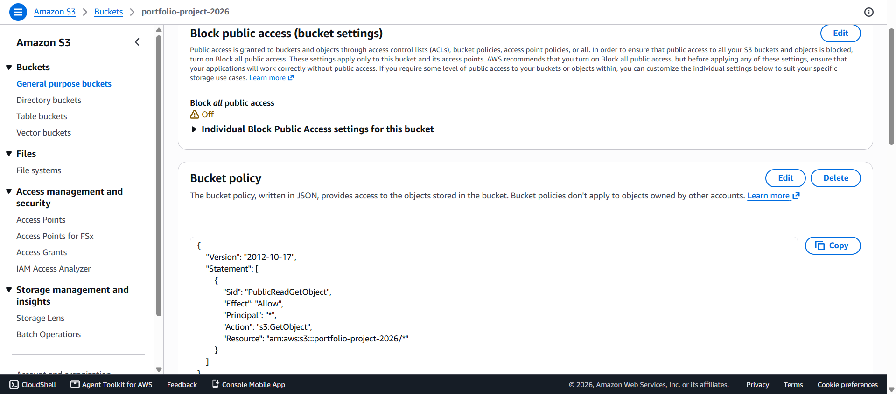
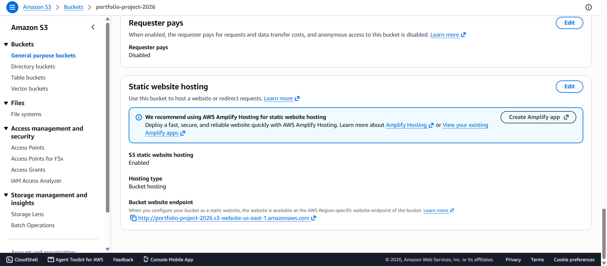
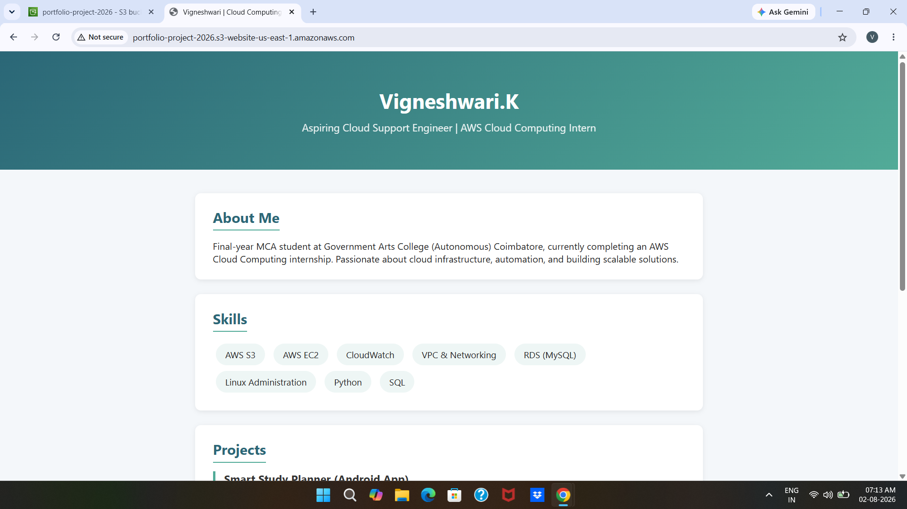

# AWS S3 Static Website Hosting — Portfolio Project

## 📌 Overview
Hosted a static portfolio website using **AWS S3 Static Website Hosting**, 
as part of the **DecodeLabs Cloud Computing Internship — Project 1: The Global Launch**.

The goal was to deploy a personal portfolio website globally, without provisioning 
a single server, using pure cloud storage infrastructure.

## 🌐 Live URL
http://portfolio-project-2026.s3-website-us-east-1.amazonaws.com

## 🛠️ Tech Used
- AWS S3 (Static Website Hosting)
- S3 Bucket Policy (Public Read Access via `s3:GetObject`)
- HTML5 / CSS3

## 📋 Steps Followed
1. Created an S3 bucket with a globally unique name (`portfolio-project-2026`)
2. Unblocked public access at the bucket level
3. Enabled **Static Website Hosting** under bucket Properties
   - Index document: `index.html`
   - Error document: `404.html`
4. Uploaded website files (`index.html`, `404.html`) to the bucket root
5. Configured a **Bucket Policy** for public read access (`s3:GetObject`)
6. Verified the live, globally accessible URL

## 📁 Files in this Repo
- `index.html` — Portfolio homepage
- `404.html` — Custom error page

## 📷 Screenshots

**S3 Bucket Configuration**

**Static Website Hosting Enabled**

**Live Website**

## 💡 Key Learnings
- S3 static website hosting works differently from S3 object storage — 
  it requires enabling the specific "Static Website Hosting" property, 
  not just uploading files.
- Public read access must be explicitly granted via a Bucket Policy; 
  S3 blocks public access by default for security.
- A custom 404 error page improves user experience for broken links, 
  even on serverless architecture.
  
## 🎯 Outcome
A publicly accessible, low-latency static website hosted entirely on AWS S3 —
demonstrating serverless hosting, IAM-based access control, and cloud storage architecture.

---
**Internship:** Cloud Computing (AWS/Azure) — DecodeLabs  
**Project:** 1 of 4 — The Global Launch
