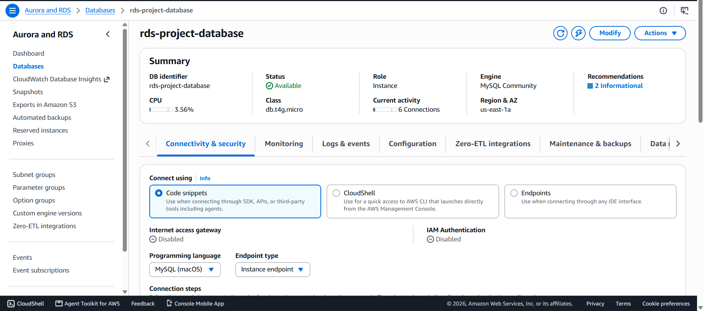
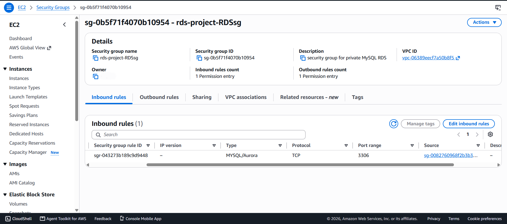
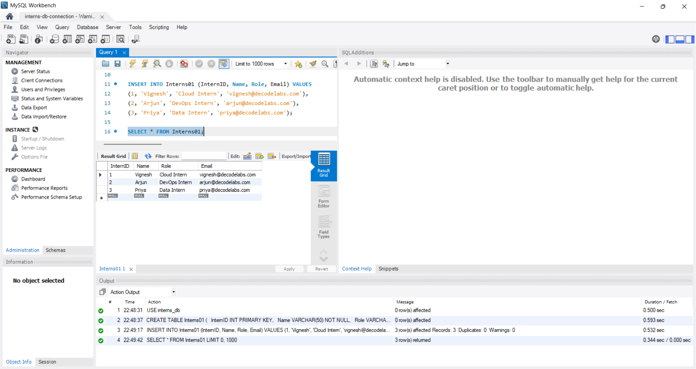
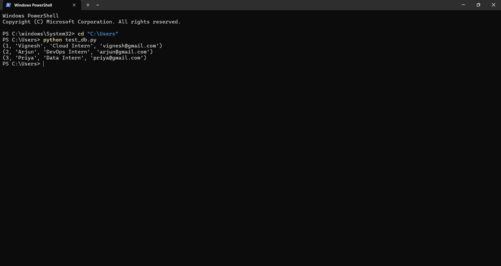

# Project 3: The Data Warehouse

## 📌 Objective
Provision a managed cloud database on AWS RDS inside a secure, private network architecture, and verify reliable data persistence — simulating a real-world Database Administrator / Cloud Infrastructure task for an e-commerce company outgrowing spreadsheet-based data management.

## 🛠️ Tools & Technologies
- AWS VPC (Custom VPC, Public & Private Subnets)
- AWS EC2 (Bastion Host — Amazon Linux 2023)
- AWS RDS (MySQL Community Engine, db.t4g.micro)
- AWS Security Groups (Firewall)
- MySQL Workbench (SSH Tunnel Connection)
- Python (pymysql)
- SSH (Windows PowerShell)

## 🚀 Steps Performed

### 1. Built the Network Foundation
- Created a custom VPC with public and private subnets across 2 Availability Zones
- Attached an Internet Gateway and configured route tables:
  - Public subnets → route to Internet Gateway
  - Private subnets → no internet route (fully isolated)

### 2. Launched the Bastion Host
- Launched an EC2 instance (Amazon Linux 2023) in the **public subnet**
- This instance acts as a secure SSH gateway into the private network

### 3. Provisioned the RDS Instance
- Engine: MySQL Community
- Instance class: db.t4g.micro (Free Tier eligible)
- Storage: 20 GB General Purpose SSD
- Deployed into a **DB Subnet Group** using only private subnets
- **Public access: Disabled** — no direct route from the internet

### 4. Configured Security Groups

| Type | Port | Source |
|---|---|---|
| MySQL/Aurora | 3306 | Bastion Host Security Group only |
| SSH | 22 | My IP only |

### 5. Connected via SSH Tunnel
Bridged the network isolation using the bastion as a jump host:
ssh -i "servercommander.pem" -L 3306:<RDS-Endpoint>:3306 ec2-user@<Bastion-Public-IP>

### 6. Connected with MySQL Workbench
- Connection Method: **Standard TCP/IP over SSH**
- SSH Hostname: Bastion public IP
- MySQL Hostname: RDS endpoint
- Verified successful connection despite a version-compatibility notice (RDS running MySQL 8.4.9)

### 7. Designed the Schema
```sql
CREATE TABLE Interns01 (
  InternID INT PRIMARY KEY,
  Name VARCHAR(50) NOT NULL,
  Role VARCHAR(50) NOT NULL,
  Email VARCHAR(100) UNIQUE NOT NULL
);
```

### 8. Inserted Dummy Records
```sql
INSERT INTO Interns01 (InternID, Name, Role, Email) VALUES
(1, 'Vignesh', 'Cloud Intern', 'vignesh@decodelabs.com'),
(2, 'Arjun', 'DevOps Intern', 'arjun@decodelabs.com'),
(3, 'Priya', 'Data Intern', 'priya@decodelabs.com');
```

### 9. Verified Data Persistence
```sql
SELECT * FROM Interns01;
```
Confirmed all 3 records returned successfully in MySQL Workbench.

### 10. Bonus: Verified via Python (pymysql)
Connected independently through the same SSH tunnel using a Python script and printed all records — confirming the database is programmatically accessible for real application use.

## 📁 Files in this Repo
- `test_db.py` — Python script verifying RDS connectivity via pymysql

## 📷 Screenshots

**RDS Instance (Available, Private)**


**Security Group — Port 3306 Restricted**


**MySQL Workbench — Table & SELECT Query**


**Python Script Output**



## 💡 Key Learnings
- A publicly accessible database is a compromised database — placing RDS in a private subnet with public access disabled removes it entirely from internet reach.
- Security Groups are stateful firewalls; restricting the source to another Security Group (not an IP range) is far more secure and scalable than IP-based rules.
- An SSH tunnel through a bastion host is the standard pattern for reaching private cloud resources without exposing them directly.
- Schema constraints (PRIMARY KEY, UNIQUE, NOT NULL) enforce data integrity at the database level, preventing bad data before it's ever written.
- AWS manages the underlying hardware and OS patching for RDS, but the schema design and access control remain the engineer's responsibility.

## ✅ Result
Successfully architected and secured a production-style managed database layer on AWS RDS, demonstrating private network isolation, bastion-based access control, and Database-as-a-Service (DBaaS) fundamentals.

---
**Internship:** Cloud Computing (AWS/Azure) — DecodeLabs

**Project:** 3 of 4 — The Data Warehouse
