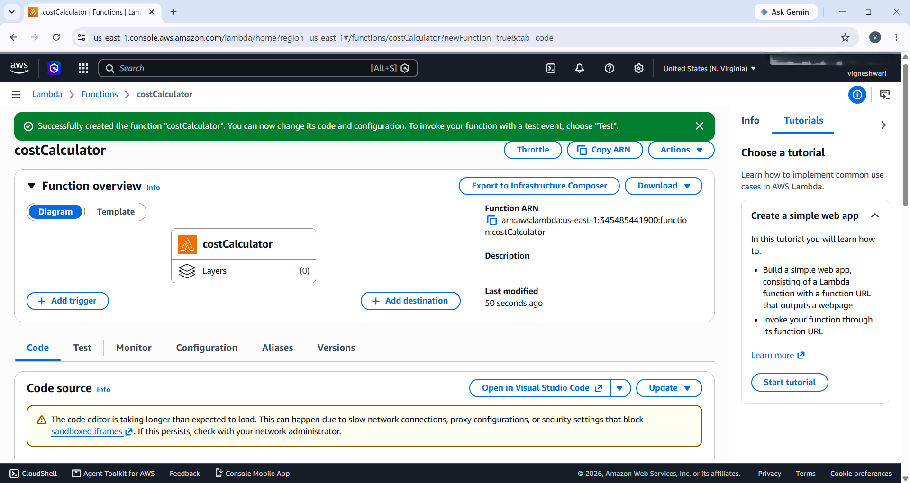
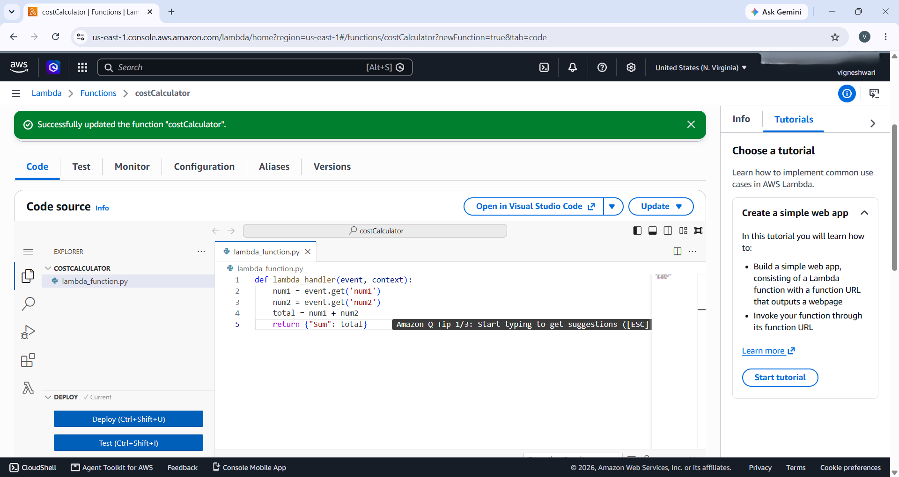
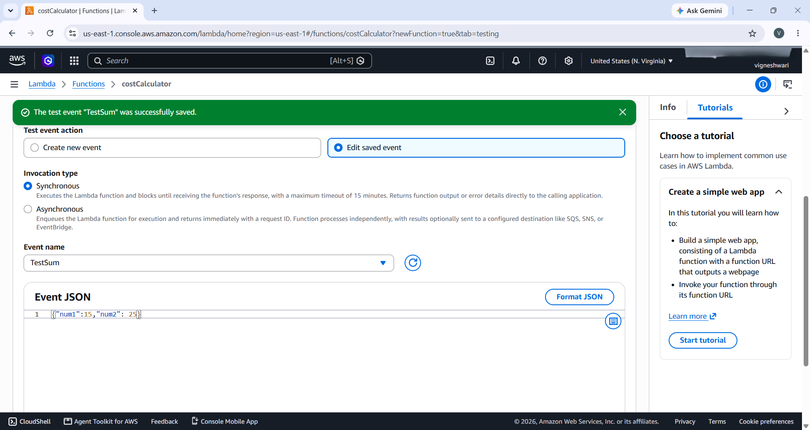
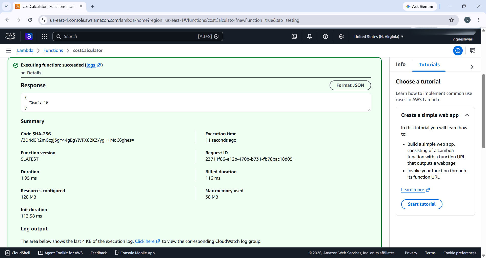
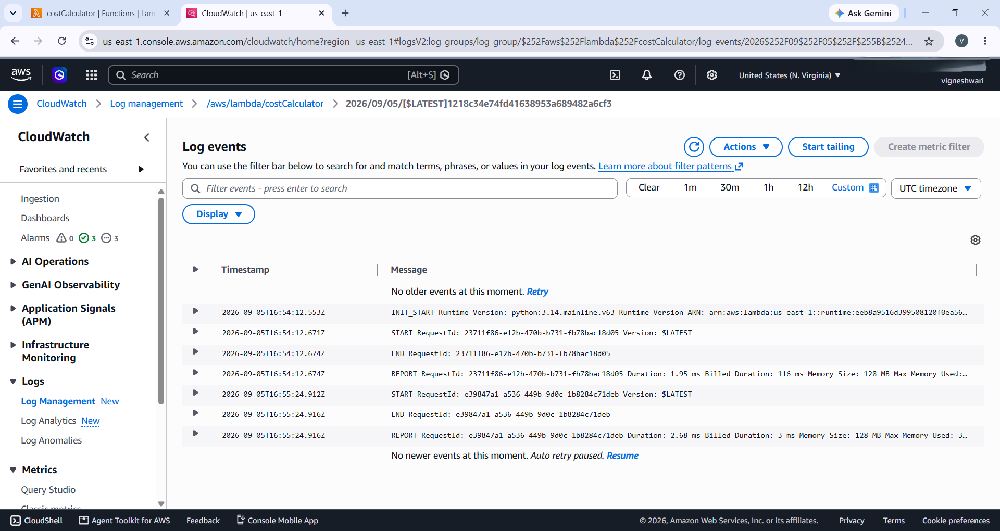

# Project 4: The Serverless Logic

## 📌 Objective
Deploy a functional "Cost Calculator" API backend using AWS Lambda — without provisioning, touching, or managing a single piece of server infrastructure — simulating a real-world Cloud Infrastructure Engineer task for a company that needs a lightweight, event-driven compute solution instead of a wastefully expensive 24/7 server.

## 🛠️ Tools & Technologies
- AWS Lambda (Serverless Compute, FaaS)
- Python 3.14 (Runtime)
- AWS IAM (Auto-generated Execution Role)
- Amazon CloudWatch (Logs & Monitoring)

## 🚀 Steps Performed

### 1. Created the Lambda Function
- Navigated to the AWS Lambda service in the console
- Selected **Author from scratch**
- Function name: `costCalculator`
- Runtime: **Python 3.14**
- Architecture: **x86_64** (default)

### 2. Reviewed the Execution Role
- Left the default option: **Create a new role with basic Lambda permissions**
- This auto-generated an IAM Execution Role scoped only to upload logs to Amazon CloudWatch — no other permissions granted
- Verified the **Principle of Least Privilege**: by default, Lambda functions have zero permissions until explicitly attached

### 3. Wrote the Function Logic
```python
def lambda_handler(event, context):
    num1 = event.get('num1')
    num2 = event.get('num2')
    total = num1 + num2
    return {"Sum": total}
```
- `event` — a dictionary containing the raw JSON payload sent to the function
- `context` — contains runtime information from AWS (e.g., timeout limits)
- Returns a JSON-serializable dictionary as the response

### 4. Deployed the Code
- Clicked **Deploy** in the console to push the code live
- Confirmed via the "Successfully updated the function costCalculator" banner

### 5. Simulated a Live API Request
Since Lambda functions require a triggering event rather than running locally, created a test event named **TestSum** using the AWS Console's built-in **Test** feature:
```json
{"num1": 15, "num2": 25}
```

### 6. Verified Execution Result
Invoked the function and received:
```json
{
  "Sum": 40
}
```
Execution status: **Succeeded**

| Metric | Value |
|---|---|
| Duration | 1.95 ms |
| Billed Duration | 116 ms |
| Init Duration | 113.58 ms |
| Memory Configured | 128 MB |
| Max Memory Used | 38 MB |
| Request ID | 23711f86-e12b-470b-b731-fb78bac18d05 |

### 7. Verified via Amazon CloudWatch Logs
Navigated to the log group `/aws/lambda/costCalculator` and confirmed the full execution trace:
INIT_START Runtime Version: python:3.14.mainline.v63
START RequestId: 23711f86-e12b-470b-b731-fb78bac18d05 Version: $LATEST
END RequestId: 23711f86-e12b-470b-b731-fb78bac18d05
REPORT RequestId: 23711f86-e12b-470b-b731-fb78bac18d05 Duration: 1.95 ms Billed Duration: 116 ms Memory Size: 128 MB Max Memory Used: 38 MB

Ran a second invocation to confirm consistency — completed in 2.68 ms with 3 ms billed duration, proving the "cold start vs warm start" behavior (first call includes init overhead, subsequent calls are faster).

## 📁 Files in this Repo
- `lambda_function.py` — Lambda handler script (sum calculator logic)

## 📷 Screenshots

**Lambda Function Created (costCalculator)**


**Code Source — lambda_handler**


**Test Event Configuration (TestSum)**


**Successful Execution Result**


**CloudWatch Logs Output**


## 💡 Key Learnings
- Serverless computing (FaaS) charges only for exact execution time ("millisecond billing"), unlike a traditional EC2 instance that charges for uptime regardless of usage — the "Apartment vs. Taxi" cost model.
- Lambda functions have zero permissions by default; an IAM Execution Role must be explicitly attached to grant even basic capabilities like writing logs.
- The `event` object is how external triggers (API calls, JSON payloads) pass data into a Lambda function, and the function must return a JSON-serializable response.
- AWS Console's "Test Event" feature allows simulating real API traffic without needing to build a front-end application first.
- CloudWatch logs provide a permanent, auditable record of every invocation — including exact billed duration and memory usage — useful for both debugging and cost tracking.
- Observed the difference between a "cold start" (first invocation, includes Init Duration) and a "warm start" (subsequent invocation, much faster) — a key serverless performance concept.

## ✅ Result
Successfully deployed and tested a fully functional serverless Cost Calculator API on AWS Lambda. The function correctly computed `{"Sum": 40}` for the input `{"num1": 15, "num2": 25}`, executed in under 2 milliseconds, and demonstrated zero-cost idle behavior — fulfilling core serverless architecture principles.

---
**Internship:** Cloud Computing (AWS/Azure) — DecodeLabs

**Project:** 4 of 4 — The Serverless Logic
